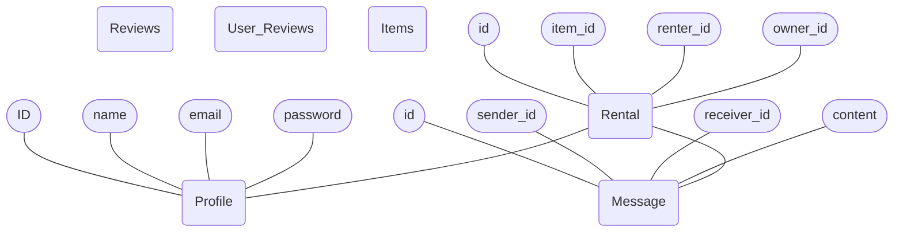

```mermaid
flowchart 
t1(Profile)
t2(Rental)
t3(Message)
t4(Reviews)
t5(User_Reviews)
t6(Items)

t1p1([ID])--- t1
t1p2([name]) --- t1
t1p3([email]) --- t1    
t1p4([password]) --- t1

t2p1([id]) --- t2
t2p2([item_id]) --- t2  
t2p3([renter_id]) --- t2
t2p4([owner_id]) --- t2

t3p1([id]) --- t3
t3p2([sender_id]) --- t3
t3p3([receiver_id]) --- t3
t3p4([content]) --- t3


t2 --- t1
t2 --- t3
```

